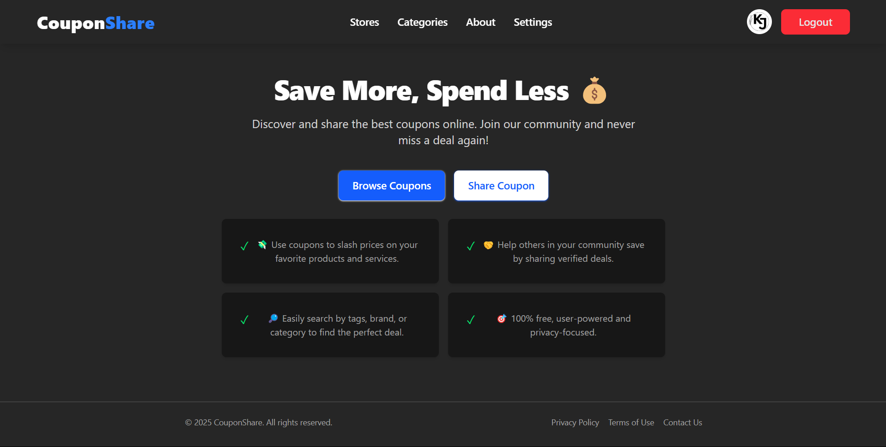

# 🧾 CouponShare - Save More, Share More!

> A community-driven platform for sharing and discovering the best online coupons. 💸  
> Built with 💙 using React + Appwrite + Tailwind CSS



---

## 🔗 Live Demo

🌐 [couponshare.joyalgeorgekj.com](https://couponshare.joyalgeorgekj.com)

---

## 📁 Project Structure

```
.
├── public/
│   └── logo.png
├── src/
│   ├── components/
│   ├── pages/
│   │   ├── Home.jsx
│   │   ├── About.jsx
│   │   ├── Settings.jsx
│   │   ├── Terms.jsx
│   │   ├── Privacy.jsx
│   │   ├── NotFound.jsx
│   ├── routes/
│   └── App.jsx
├── vercel.json
└── README.md
```

---

## 🚀 Tech Stack

| Tool           | Usage                          |
|----------------|--------------------------------|
| **React JS**   | Frontend Library               |
| **Vite**       | Fast bundling & dev server     |
| **Tailwind CSS** | Styling with dark/light theme |
| **Redux Toolkit** | Global state management     |
| **Appwrite**   | Auth, DB, Functions, Realtime  |
| **Lucide Icons** | Modern icon pack             |
| **React Router DOM** | Page routing             |

---

## 🌐 Available Routes

| Path               | Description                            |
|--------------------|----------------------------------------|
| `/`                | Home Page                              |
| `/about`           | About Page                             |
| `/settings`        | User Settings                          |
| `/privacy`         | Privacy Policy                         |
| `/terms`           | Terms and Conditions                   |
| `/stores`          | View all coupons                       |
| `*`                | 404 - Not Found                        |

---

## 🧠 Database Design (Appwrite)

### `Users Collection`

| Field      | Type     | Description                     |
|------------|----------|---------------------------------|
| `uid`      | string   | Appwrite user ID                |
| `email`    | string   | User email                      |
| `name`     | string   | Display name                    |
| `avatar`   | string   | Profile picture                 |

### `Coupons Collection`

| Field      | Type       | Description                        |
|------------|------------|------------------------------------|
| `title`    | string     | Coupon title                       |
| `description` | string  | Description of the coupon          |
| `tags`     | string[]   | Relevant tags                      |
| `code`     | string     | Coupon code (optional)             |
| `redirect` | string     | Redirect URL (optional)            |
| `userId`   | string     | User who submitted the coupon      |

---

## 🧭 App Workflow

1. **User Authentication** — via Google OAuth (Appwrite)
2. **Create & Share Coupons** — input title, description, tags, and optionally a code/redirect
3. **Community Discovery** — users browse and copy active deals
4. **Settings & Privacy** — users can control preferences or delete account
5. **Error Handling** — beautiful error pages with animations
6. **SEO & Accessibility** — optimized for web crawlers and users

---

## 🎯 Features

- 🔒 Secure login via Appwrite OAuth
- 💬 Add, update, and discover coupons in real-time
- 🎨 Dark/Light mode with Tailwind
- 🔔 Toast notifications and alerts
- ✅ Responsive & Mobile Friendly
- ⚡️ Optimized for SEO and fast load time
- 🤝 Community-first & open-source

---

## 🛠 Environment Variables

Rename `.env.example` to `.env` and add the following:

```env
VITE_APPWRITE_PROJECT_ID=your_project_id
VITE_APPWRITE_REDIRECT_URL=https://appwrite.yourdomain.com
VITE_APPWRITE_DATABASE_ID=your_database_id
```

---

## 📸 Preview


---

## 🌱 Contributing

We welcome contributions from everyone!  
Help improve CouponShare or suggest features — open an issue or fork this repo!

```bash
git clone https://github.com/your-username/couponshare.git
cd couponshare
npm install
npm run dev
```

### 🔖 Things you could help with:

- Better coupon sorting or tag filtering
- Adding markdown support to coupon descriptions
- Notification system or chat
- Admin dashboard & spam control

---

## 📃 License

MIT © [Joyal George K J](https://joyalgeorgekj.com)

---

## ✨ Support

If you like this project, please consider starring ⭐ the repo or sharing it with your friends!  
You can also donate via the built-in Donation button in the app ❤️